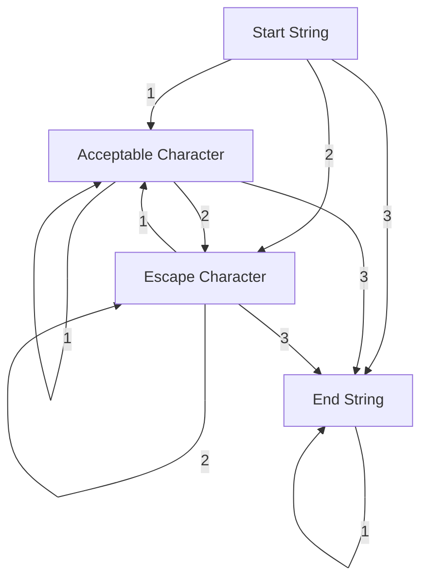
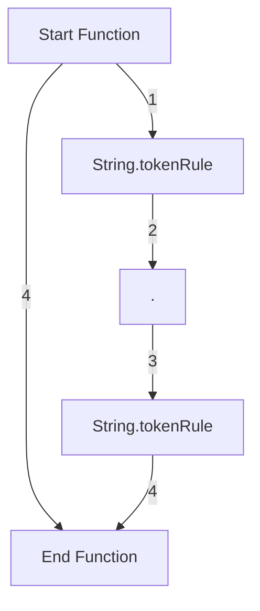

# Tkinter for JSON
This is a mini-project created during my teenage years as a "proof of concept" to how you could create tkinter GUIs by configuring widgets in a JSON like structure. In reflection, HTML5 has a similar and complementary data model and would of been a better option. I could of also used JSON itself instead of trying to create a new programming language arrogantly named "DSON" (David-Script-Object-Notation). I guess this is forshadowing to my degree choice of mathematics (mathematicians love naming things after themselves). Below you'll find the token rules that define string and function data type for the language and some information on how the code works below it. You can find the other data type definitions in `tokenRules.py`.

### String:

### Function

`main.py`
This Python script is an interpreter for a custom JSON-like language designed to create tkinter GUIs. It follows these steps:

- Import required modules.
- Initialize the tokenizer with the input file.
- Tokenize the input code.
- Initialize the compiler with tokenized data.
- Compile the code.

Use this script with your JSON-like code as an input argument to generate a tkinter GUI.

`tokenizer.py` As the name would suggest, this script processes the raw characters in the `.tk` files used for my interpreter: 

- **Initialization**: The script initializes with a specified working file and processes its contents.

- **Tokenization**: It tokenizes the working file, ensuring proper formatting and structure.

- **Parsing**: The code performs parsing based on defined token rules, guiding the creation of tkinter GUI elements.

- **Error Handling**: If an invalid token is encountered, the script raises a `SyntaxError` with details about the problematic token.

- **Main Loop**: The main loop processes tokens, navigating through the token rules to generate GUI elements.

Usage:
- Provide the path to your JSON-like code file as an argument when creating an instance of the `Tokenizer` class.
- Run the `mainloop()` method to interpret and generate tkinter GUI components.

`compiler.py` This python script takes the tokenized content and converts it it into actual instructions tkinter can understand. It works as follows:

- **Initialization**: The script takes the tokenized working file contents as input.

- **Compilation**: It compiles the tokenized data into tkinter GUI components following the provided JSON-like structure.

- **Frame Dictionary**: The script maintains a dictionary to track tkinter frames and widgets, allowing for hierarchical organization.

- **Widget Creation**: For each GUI element described in the JSON-like input, the compiler creates the corresponding tkinter widget, configures its attributes, and arranges it on the grid.

- **Main Loop**: After creating the widgets, the script enters the tkinter main loop, displaying the GUI.

Usage:
- Create an instance of the `Compiler` class with the tokenized working file contents as input.
- Call the `compile()` method to generate the tkinter GUI based on the JSON-like code.

