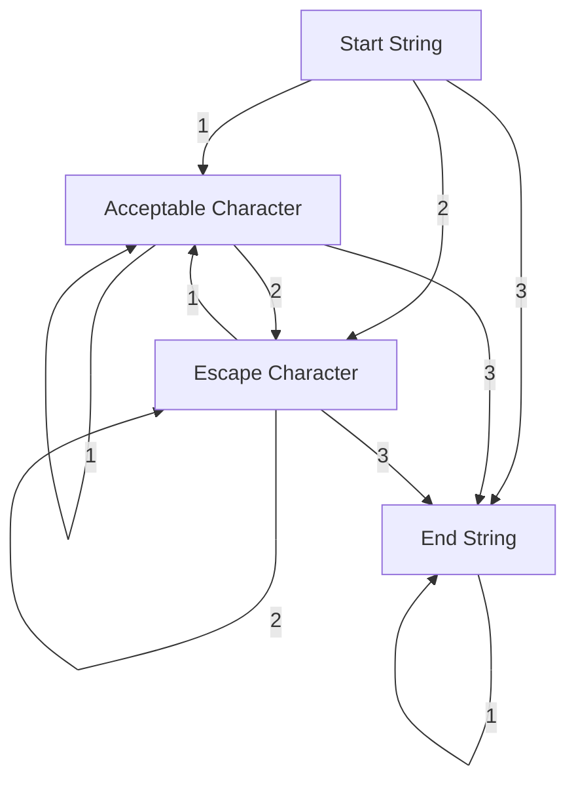
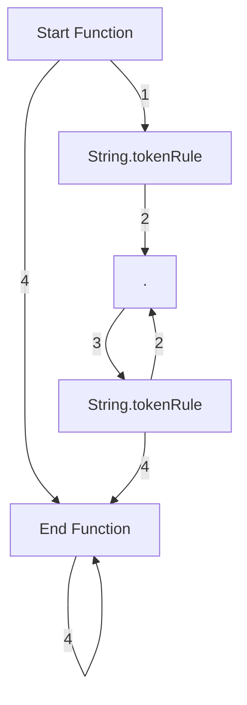
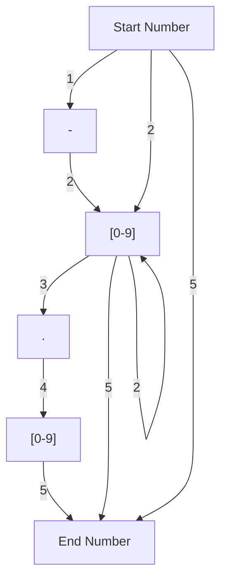
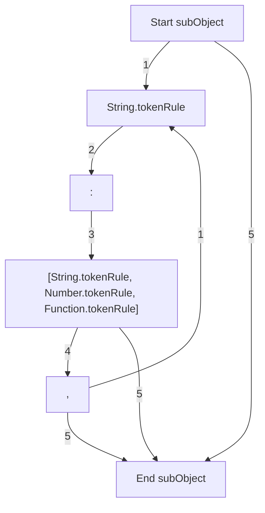

# Tkinter for JSON
This is a mini-project created as a "proof of concept" to show how you could create python tkinter GUIs by configuring widgets in a JSON like structure. In reflection, HTML5 has a similar and complementary data model and would of been a better option. I could of also used JSON itself instead of trying to create a new programming language. While it allows for nested objects (analagous to frames organised in a heirarchical struture in a Tkinter GUI), it only allows a single level of nesting as it doesn't feature recursion. To keep things simple, certain restricted characters were used to indicate the start and end of all objects but in reality, its hardly practical to indicate a number by placing two hashtags either side of it. 

Below you'll find the token rules that define some of the data types for the language. You can find the other data type definitions in `tokenRules.py`.

### String

### Function

### Number

### subObject

